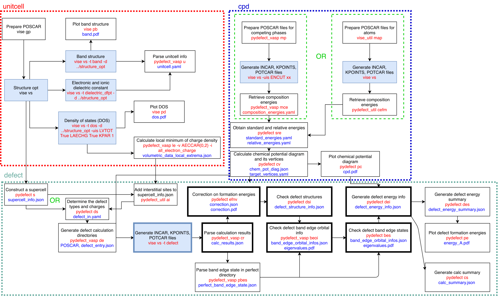
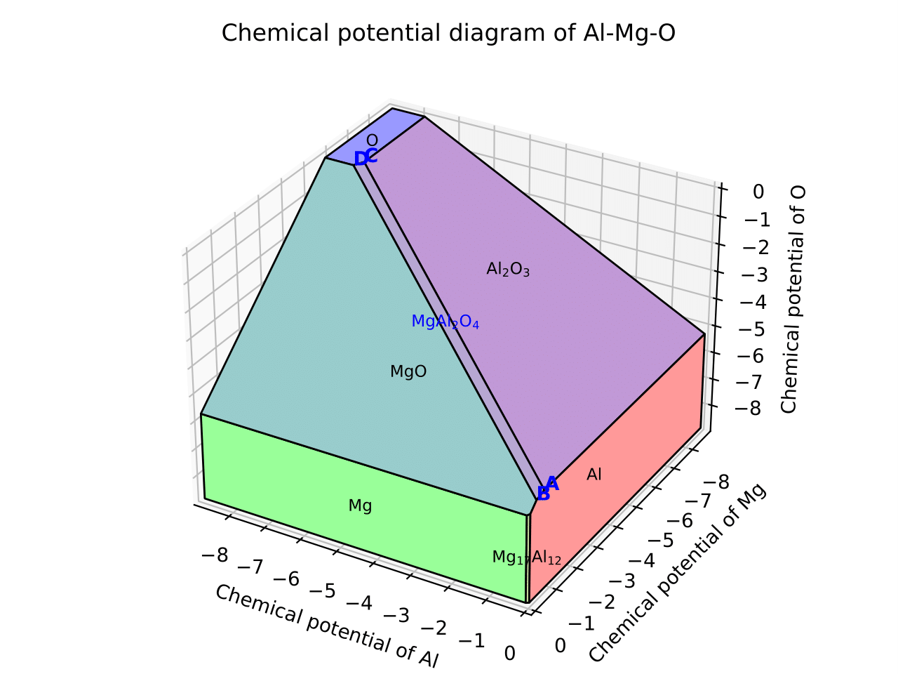
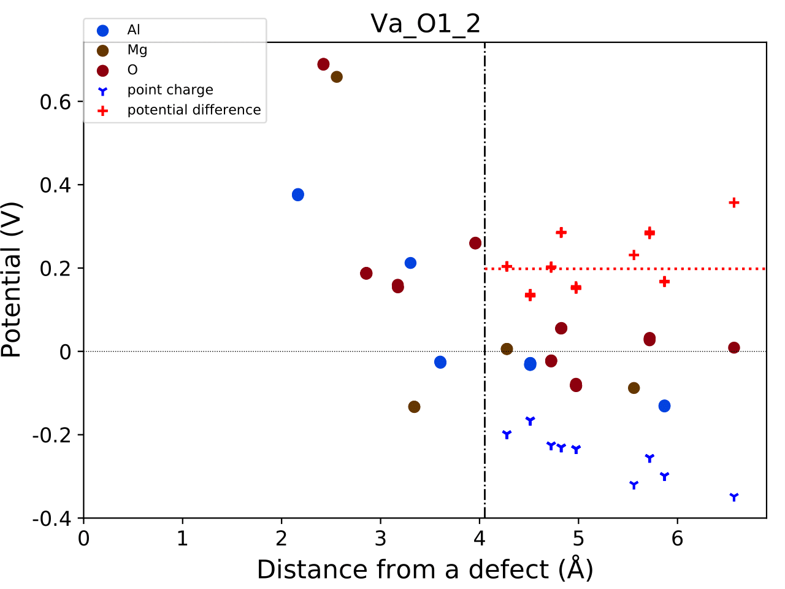
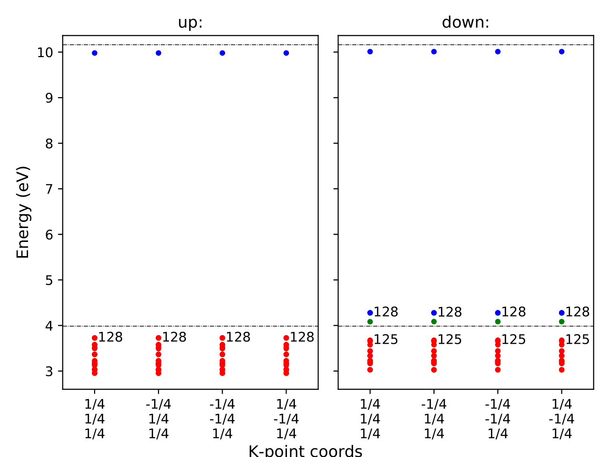

Tutorial of pydefect
--------------------

This page illustrates how to use the :code:`pydefect` code.

**Note1: Pydefect now supports only the vienna ab-initio simulation package (VASP),
so we suppose its input and output file names (e.g., POSCAR, POTCAR, OUTCAR),
and computational techniques (e.g., periodic boundary condition) used in VASP.**

**Note2: Units used in pydefect are eV for energy and Angstrom for length
following the vasp convention.**

**Note3: Only nonmagnetic host materials are supposed for now.**

Workflow of a point-defect calculation in a non-metallic solid is shown below.
One can see some tasks are performed concurrently, while others must follow some tasks.
Usually, the processes are intricate and time consuming and researchers are prone to make mistakes.
The main purpose of :code:`pydefect` is to provide the researchers
with the automation system for the point-defect calculations in non-metallic materials
so that they save time and reduce human errors.

This cheat sheet is divided into three parts, namely unitcell, cpd, and defect,
which correspond to the working directories as shown below.
The red texts indicate the related commands, while blue ones the files created with these commands.
The branching steps provide for two options.
The filled rectangles with blue color require the VASP calculations,
while the bolded ones associate multiple directories related to defects considered.
The green rectangle steps are not essential.

Here, we suppose the following directory tree.
The :code:`<project_name>` is usually the target material name with the
crystal structure if needed, e.g., rutile-TiO\ :sub:`2`.

::

    <project_name>
     │
     ├ pydefect.yaml
     ├ vise.yaml
     │
     ├ unitcell/ ── structure_opt/
     │            ├ band/
     │            ├ dielectric/
     │            └ dos/
     │
     ├ cpd/ ──── <competing_phase 1>
     │       ├── <competing_phase 2>
     │           ....
     │
     └ defect/ ── perfect/
                ├─ Va_X_0/
                ├─ Va_X_1/
                ├─ Va_X_2/
                 ...

We recommend the users to follow the same directory structure if possible.
Details of the processes are examined step by step
with an example of MgAl2O4 calculated using the PBEsol functional.

In :code:`pydefect`, there are five main commands, namely
:code:`pydefect`, :code:`pydefect_vasp`, :code:`pydefect_util`,
:code:`pydefect_vasp_util`, and :code:`pydefect_print`.
:code:`Pydefect_vasp` and :code:`pydefect_vasp_util` are related to the VASP,
while :code:`pydefect` and :code:`pydefect_util` are independent of the DFT code.
Those consisting of a suffix, :code:`_util`, are not essentially needed but are useful in some cases.

There are also many arguments for each sub-command.
One can always refer its help with the :code:`-h` argument, e.g.,

::

    pydefect s -h

for details.

===============================
1. Relaxation of the unit cell
===============================
The point-defect calculations are generally performed at the theoretically relaxed
structure under the given functional and projector augmented wave (PAW) potentials,
as it is free from artificial strain and stress
that is responsible for the unwanted supercell size dependency.
Therefore, one usually begins with optimizing lattice constants
and fractional coordinates of the atomic positions in the unitcell.

We first prepare :code:`POSCAR` of the pristine bulk unitcell,
and create :code:`unitcell/` directory and :code:`unitcell/structure_opt/`
sub-directory ( :code:`mkdir -p unitcell/structure_opt/`) and move there.
(In this tutorial, the name with :code:`/` at the end means a directory.)
When :code:`pydefect` needs to construct the vasp input files,
namely :code:`INCAR`, :code:`POTCAR`, :code:`KPOINTS` files,
we use `vise <https://kumagai-group.github.io/vise/>`_
(= :code:`vasp integrated supporting environment`) code,
which generates the input files for various tasks and exchange-correlation (XC) functionals.
:code:`Vise` relies on the `pymatgen <http://pymatgen.org>`_, and
therefore, as shown `pymatgen web page 1 <https://pymatgen.org/usage.html>`_ or
`2 <https://pymatgen.org/_modules/pymatgen/io/vasp/inputs.html>`_,
we need to set the :code:`PMG_DEFAULT_FUNCTIONAL` and :code:`PMG_VASP_PSP_DIR`
in the :code:`.pmgrc.yaml` file at the home directory, e.g.,

::

    PMG_DEFAULT_FUNCTIONAL: PBE_54
    PMG_MAPI_KEY: xxxxxxxxxxxxxxxx
    PMG_VASP_PSP_DIR: /home/kumagai/potcars/

In :code:`pydefect`, :code:`PMG_MAPI_KEY` is required for querying
:code:`POSCAR` files and total energies for competing materials.

Input files for optimizing a unitcell using the PBEsol functional
are generated by the following command,

::

    vise vasp_set -x pbesol

where :code:`vasp_set`, or its abbreviation :code:`vs`,
is a sub-command option of the :code:`vise` main function.
Similarly, all the sub-commands have their own abbreviations
in :code:`pydefect` and :code:`vise`.
Here, the PBE functional is a default in :code:`vise`,
so we use the :code:`-x` argument to switch the XC functional to PBEsol.

Note that the structure optimization must be generally iterated with 1.3 times larger
cutoff energy until the forces and stresses are converged at the first ionic step.
See, `vasp manual <https://www.vasp.at/wiki/index.php/Energy_vs_volume_Volume_relaxations_and_Pulay_stress>`_
for details.
Such iteration of the vasp calculations is not supported by :code:`pydefect`,
but one can easily write the simple runshell script to do so.

In :code:`pydefect`, users can control various default parameters as :code:`vise.yaml` file in :code:`vise`.
See the `document of vise <https://kumagai-group.github.io/vise/>`_ for details.
The controllable parameters are shown in :code:`defaults.py` in :code:`pydefect`.

=====================================================
2. Calculation of band, DOS, and dielectric tensor
=====================================================
We then calculate the band structure (BS), density of states (DOS), and dielectric constants.
In the defect calculations, the BS is used for determining
the valence band maximum (VBM) and conduction band minimum (CBM),
while the dielectric constant, or a sum of electronic (or ion-clamped) and ionic dielectric tensors,
is needed for correcting the defect formation energies.

First, we create :code:`band/`, :code:`dos/` and :code:`dielectric/` in :code:`unitcell/`
and copy :code:`POSCAR` from :code:`unitcell/structure_opt/`
and type the following command in each directory:

::

    vise vs -x pbesol -t band -d ../structure_opt
    vise vs -x pbesol -t dos -d ../structure_opt -uis LVTOT True LAECHG True KPAR 1
    vise vs -x pbesol -t dielectric_dfpt -d ../structure_opt

The additional user_incar_settings (=uis) in the :code:`dos` directory are for creating volumetric
data of electrostatic potential and all electron charge density.

:code:`Vise` also provides the plotters for the BS and DOS.
See the `document of vise <https://kumagai-group.github.io/vise/>`_ for details.

============================================================================
3. Gathering unitcell information related to point-defect calculations
============================================================================
We next collect the bulk information,
namely the band edges and electronic and ionic dielectric tensors
using the :code:`unitcell` (= :code:`u`) sub-command.

::

    pydefect_vasp u -vb band/vasprun-finish.xml -ob band/OUTCAR-finish -odc dielectric/OUTCAR-finish -odi dielectric/OUTCAR-finish -n MgAl2O4

Here, the electronic and ionic dielectric constants can be set
with different :code:`OUTCAR` files.
Then, :code:`unitcell.yaml` is generated, which will be used for analyzing defect calculations later.

::

    system: MgAl2O4
    vbm: 4.0183
    cbm: 9.2376
    ele_dielectric_const:
    - - 3.075988
      - 0.0
      - -0.0
    - - 0.0
      - 3.075988
      - 0.0
    - - -0.0
      - -0.0
      - 3.075988
    ion_dielectric_const:
    - - 5.042937
      - -0.0
      - -0.0
    - - -0.0
      - 5.042937
      - 0.0
    - - -0.0
      - 0.0
      - 5.042937

Of course, the users can also create it by hand.

==================================
4. Calculation of competing phases
==================================
When a defect is introduced, atoms are exchanged with the hypothetical atomic
reservoirs within the thermodynamics framework.
To calculate a free energy of defect formation that is approximated
with the defect formation energy in most cases,
we need to determine atom's chemical potentials associated with defects.
Usually, we consider the chemical potentials at the condition
where competing phases coexist with the host material,
which are determined from the chemical potential diagram (CPD).

For this purpose, we create directories in :code:`cpd/`.
We can retrieve POSCARs of the stable or slightly unstable competing phases
from `the Materials Project database (MPD) <https://materialsproject.org>`_.
For this purpose, one needs `the API keys <https://materialsproject.org/open>`_
of the MP as mentioned above.
We obtain the competing materials with MgAl2O4 whose energies above hull are less than 0.5 meV/atom using

::

    pydefect_vasp mp -e Mg Al O --e_above_hull 0.0005

This command creates the following directories:

::

    Al2O3_mp-1143/  Al_mp-134/  Mg149Al_mp-1185596/  Mg17Al12_mp-2151/  MgAl2O4_mp-3536/  MgAl2_mp-1094116/  MgO_mp-1265/  Mg_mp-1056702/  mol_O2/

We here remove :code:`Mg149Al_mp-1185596/` to reduce computational time in this tutorial.
In each directory, there are :code:`POSCAR` and :code:`prior_info.yaml`.
The :code:`prior_info.yaml` contains some information retrieved from the MPD,
which is useful for determining the conditions for the first-principles calculations via :code:`vise`.

For example, :code:`Mg_mp-1056702/prior_info.yaml` is shown as

::

    band_gap: 0.0
    data_source: mp-1056702
    total_magnetization: 0.0007357

which means Mg is a non-magnetic metallic system.
:code:`Vise` parses the :code:`prior_info.yaml`
and determines the k-point density in :code:`KPOINTS`
and spin polarization via :code:`ISPIN` tag in :code:`INCAR`.
If the retrieved values are obviously incorrect, the user may change the values by hand.

O\ :sub:`2`, H\ :sub:`2`, N\ :sub:`2`, NH\ :sub:`3`, and NO\ :sub:`2` molecules
are not retrieved from the MPD but created by :code:`pydefect` itself,
since these compositions have been calculated as solids in the MPD,
which could be inadequate for competing phases for the defect calculations.

We then generate :code:`INCAR`, :code:`POTCAR`, :code:`KPOINTS` files for these.
We need to use the **common cutoff energy**, :code:`ENCUT`, for comparing the total energies,
which is increased to 1.3 times of **max** :code:`ENMAX` between the constituent POTCARs.
In case of MgAl2O4, :code:`ENMAX` of Mg, Al, and O are 200.0, 240.3 and 400.0 eV,
so we need to set :code:`ENCUT = 520.0`, using the :code:`vise`.

::

    for i in *_*/;do cd $i; vise vs -uis ENCUT 520.0 -x pbesol ; cd ../;done

The target material, namely MgAl2O4 in this example, has already been calculated in the same condition,
so we do not have to iterate the same calculation;
instead make a symbolic link by :code:`ln -s ../unitcell/structure_opt MgAl2O4_unitcell`
and remove the :code:`MgAl2O4_mp-3536/` directory.
However, we need to calculate it, when we adopt different :code:`ENMAX`
to keep consistency with larger :code:`ENMAX` for dopant atoms.

Note also that, if competing phases are gases, we need to change
:code:`ISIF` to 2 so as not to relax the lattice constants
(see `[vasp manual] <https://cms.mpi.univie.ac.at/wiki/index.php/ISIF>`_),
and :code:`KPOINTS` to the Gamma-point-only sampling.
This is, however, automatically tuned with :code:`vise` via :code:`prior_info.yaml`.

After finishing the vasp calculations,
we can generate the :code:`composition_energies.yaml` file,
which collects the total energies per calculated formula
using the :code:`make_composition_energies` (= :code:`mce`) sub-command.

::

    pydefect_vasp mce -d *_*/

When renaming the :code:`vasprun.xml` and :code:`OUTCAR` files to e.g.,
:code:`vasprun-finish.xml` and :code:`OUTCAR-finish` during the calculations,
one needs to write the following lines in the :code:`vise.yaml` file:

::

    # VASP file names
    outcar: OUTCAR-finish
    vasprun: vasprun-finish.xml

See `Tutorial for vise.yaml <https://kumagai-group.github.io/vise/tutorial_vise_yaml.html>`_.

We next create :code:`relative_energies.yaml` and :code:`standard_energies.yaml`
with the :code:`standard_and_relative_energies` (= :code:`sre`) sub-command.

::

    pydefect sre

The :code:`standard_energies.yaml` file collects the absolute energies under the standard states as shown.

::

    Al: -4.08372115
    Mg: -1.70955951
    O: -5.139183685

while :code:`relative_energies.yaml` includes the relative energies with respect to the standard states.

::

    Al2O3: -3.149440234
    Mg17Al12: -0.02717980137931031
    MgAl2: -0.015118513333333805
    MgAl2O4: -3.097731276428572
    MgO: -2.8318186275

We then make information on the CPD using the :code:`cpd_and_vertices` sub-command.

::

    pydefect cv -t MgAl2O4

To plot the diagram, use the :code:`plot_cpd` (= :code:`pc`) sub-command:

::

    pydefect pc

which also save the diagram as :code:`cpd.pdf`.
The binary and ternary CPDs look like

.. image:: cpd_MgO.png

Here, the vertices surrounding the target compounds are also shown as follows:

::

    target: MgAl2O4
    A:
      chem_pot:
        Al: 0.0
        Mg: -0.68785
        O: -5.24907
      competing_phases:
      - Al2O3
      - Al
      impurity_phases: []
    B:
      chem_pot:
        Al: 0.0
        Mg: -0.32348
        O: -5.34016
      competing_phases:
      - MgO
      - Al
      impurity_phases: []
    C:
      chem_pot:
        Al: -7.8736
        Mg: -5.93692
        O: 0.0
      competing_phases:
      - Al2O3
      - O
      impurity_phases: []
    D:
      chem_pot:
        Al: -8.01024
        Mg: -5.66364
        O: 0.0
      competing_phases:
      - MgO
      - O
      impurity_phases: []

If one needs to modify the energies for the CPD,
one can directly modify the :code:`relative_energies.yaml` file.

Calculations of the competing phases are often laborious,
and sometimes we want to check the defect formation energies sooner.
:code:`Pydefect` supports to create the CPD based on the MPD.
To do this, one firstly prepare atom energies that are needed for aligning the energy standards.

With :code:`vise`, we can easily prepare atom calculation directories.
Here, we show an example of MgAl2O4:

::

    vise_util map -e Mg Al O

Then, create the vasp input files

::

    for i in */;do cd $i; vise vs ; cd ../;done

and run the vasp.
The atom energies are collected to yaml file format using the following python script.

::

    from pymatgen.core import Element
    from pymatgen.io.vasp import Outcar

    for e in Element:
        try:
            o = Outcar(str(e) + "/OUTCAR-finish")
            name = str(e) + ":"
            print(f"{name:<3} {o.final_energy:11.8f}")
        except:
            pass

Assuming the output is saved to :code:`atom_energies.yaml`,
the :code:`composition_energies.yaml` file is generated using the following command.

::

    pydefect_util cefm -a atom_energies.yaml -e Mg Al O

Once :code:`composition_energies.yaml` is obtained, the following steps are the same as above.

=================================================
5. Construction of a supercell and defect species
=================================================
We have finished the calculations of the unit cell and CPD,
and now are ready for the point-defect calculations.
Let's create the :code:`defect/` directory.

We then create files related to a supercell and defect species with
the :code:`supercell` (= :code:`s`) and :code:`defect_set` (= :code:`ds`) sub-commands.

:code:`Pydefect` recommends a nearly isotropic (and sometimes cubic-like) supercell
composed of moderate number of atoms.
With the following command, one can create a :code:`SPOSCAR` file

::

    pydefect s -p ../unitcell/structure_opt/CONTCAR-finish

If the input structure is different from the standardized primitive cell, :code:`NotPrimitiveError` is raised.

At present, :code:`pydefect` constructs the supercell by expanding the *conventional* unitcell.
Generally speaking, it is possible to change the lattice angle of the supercell from those of the conventional unitcell.
For example, we can make a supercell in which a-, b-, and c-axes are mutually orthogonal for hexagonal systems.
However, it is not a good idea because such the lattice breaks the original symmetry,
which reduces the accuracy of the point-defect calculations and makes it difficult to analyze the symmetry at the defect site.
Therefore, we basically expand the lattice vector in their original directions.
One exception is the tetragonal cell, where the rotated supercells by 45 degrees keep the original symmetries.

In :code:`pydefect`, users can also specify the cell matrix, e.g.,

::

    pydefect s -p ../unitcell/structure_opt/CONTCAR-finish --matrix 2 1 1

The matrix is applied to the conventional cell.
Note, again, that if the symmetry is changed using an anisotropic supercell,
the following symmetry analysis is generally incorrect.

If one wants to know the conventional cell, type

::

    vise si -p ../unitcell/structure_opt/CONTCAR-finish -c

See the help message for more details.

Since json files are generally less readable than yaml files,
we implement the :code:`pydefect_print` command to generate readable command lines
from json files, which can be used as follows,

::

    pydefect_print supercell_info.json

The :code:`supercell_info.json` file is then shown as follows:

::

    Space group: F-43m
    Transformation matrix: [-2, 2, 2]  [2, -2, 2]  [2, 2, -2]
    Cell multiplicity: 32

       Irreducible element: Mg1
            Wyckoff letter: a
             Site symmetry: -43m
             Cutoff radius: 3.373
              Coordination: {'Se': [2.59, 2.59, 2.59, 2.59]}
          Equivalent atoms: 0..31
    Fractional coordinates: 0.0000000  0.0000000  0.0000000
         Electronegativity: 1.31
           Oxidation state: 2

       Irreducible element: Se1
            Wyckoff letter: c
             Site symmetry: -43m
             Cutoff radius: 3.373
              Coordination: {'Mg': [2.59, 2.59, 2.59, 2.59]}
          Equivalent atoms: 32..63
    Fractional coordinates: 0.1250000  0.1250000  0.1250000
         Electronegativity: 2.55
           Oxidation state: -2

With the :code:`defect_set` (= :code:`ds`) sub-command, we can build the :code:`defect_in.yaml` file.
An example of :code:`defect_in.yaml` for MgAl2O4 looks as follows,

::

    Al_Mg1: [-1, 0, 1]
    Al_O1: [-1, 0, 1, 2, 3, 4, 5]
    Mg_Al1: [-1, 0, 1]
    O_Al1: [-5, -4, -3, -2, -1, 0, 1]
    Va_Al1: [-3, -2, -1, 0, 1]
    Va_Mg1: [-2, -1, 0]
    Va_O1: [0, 1, 2]

where the combination of defect species and their charges are tabulated.
We can modify this file by hand if necessary or using :code:`--keywords` option.
If we want to add dopants, we can type as follows:

::

    pydefect ds -d Ca

There are some tips related to :code:`supercell_info.json` and :code:`defect_in.yaml`.

1. The antisites and substituted defect species are determined from the difference of
the electronegativity between the substituted and removed atoms.
Default max difference is written in `defaults.py <https://github.com/kumagai-group/pydefect/blob/master/pydefect/defaults.py>`_,
but one can change it via :code:`pydefect.yaml`.
Since pydefect uses the :code:`DefaultsBase` in vise, the
rules are the same as `vise.yaml <https://kumagai-group.github.io/vise/tutorial_vise_yaml.html>`_
except for the keywords.

2. The oxidation states determine the defect charge states.
For instance, the vacancies of Sn\ :sup:`2+` may take 0, -1, or -2 charge states,
while those of Sn\ :sup:`4+` between 0 and -4 charge states.
For the antisites and substituted defects,
:code:`pydefect` considers all the possible combinations of vacancies and interstitials.
So, for example, Sn\ :sup:`2+` -on-S\ :sup:`2-` takes 0, +1, +2, +3, and +4 charge states.
The oxidation states are determined using the :code:`oxi_state_guesses` method of
:code:`Composition` class in :code:`pymatgen`.
The users can also manually set the oxidation states as follows:

::

    pydefect ds --oxi_states Mg 4

However, the recommended charge states may not be enough in some cases.
For instance, the Zn vacancies in ZnO are known to show the +1 charge state
because they can capture multiple polarons at the neighboring O sites.
See `Frodason et al., Phys. Rev. B (2017) <journals.aps.org/prb/abstract/10.1103/PhysRevB.95.094105>`_
Users have to add these outliers by themselves.

3. By default, positions of atoms near the defect are perturbed
such that the symmetry is lowered to the P1 symmetry.
This is, however, unwanted in some cases because it increases the number of irreducible k-points
Then, :code:`displace_distance` needs to be set to 0 via :code:`pydefect.yaml`.

4. If one wants to calculate particular defects e.g., only oxygen vacancies,
you can restrict the calculated defects with :code:`-k` option and a python regular expression,
For example, when typing as follows,

::

    pydefect ds -k "Va_O[0-9]?_[0-9]+"

the following directories are created.

::

    perfect/ Va_O1_0/ Va_O1_1/ Va_O1_2/

For regular expression, see `Regular expression operations <https://docs.python.org/3/library/re.html>`_.

===================================
6. Decision of interstitial sites
===================================
In addition to the vacancies and substituted defects, one may want to take into account the interstitials.
Most people determine them by seeing the host crystal structures,
while there are a couple of procedures that recommend the interstitial sites.
It is, However, generally not an easy task to speculate the most likely interstitial sites
because they depend on the combination of the host and substituted elements.

The largest vacant space should be most likely interstitial sites
for positively charged cations with closed shells (e.g., Mg\ :sup:`2+`, Al\ :sup:`3+`),
as they tend not to make strong bonding with other atoms.
On the other hand, a proton (H\ :sup:`+`) prefers to be located near O\ :sup:`2-` or N\ :sup:`3-`
to form the strong O-H or N-H bonding.
Conversely, a hydride ion (H\ :sup:`-`) should tend to be located at a very much different place.
Therefore, we need to carefully determine the interstitial sites.

:code:`Pydefect` holds a utility that recommends the interstitial sites based on
volumetric data such as the all electron charge density in the unitcell
using the :code:`ChargeDensityAnalyzer` class implemented in :code:`pymatgen`.

To use this, we need to generate volumetric data, e.g., :code:`AECCAR` and :code:`LOCPOT`,
based on the standardized primitive cell.
This has been already done in this tutorial at the DOS calculation.
This should not be done in general at the band structure calculations,
because the primitive cells may be different from the standardized primitive cell.

After running the vasp calculation, use the following command in the directory including AECCAR{0,2}.

::

    pydefect_vasp le -v AECCAR{0,2} -i all_electron_charge

, which shows the local minima of the charge density as follows.

::

           a      b      c      value  ave_value
    0  0.125  0.125  0.125   3.387930   0.029844
    1  0.625  0.125  0.125   3.383668   0.029845
    2  0.125  0.625  0.125   3.383668   0.029845
    3  0.125  0.125  0.625   3.383445   0.029845
    4  0.500  0.500  0.500  16.501119   0.155178
    5  0.750  0.750  0.750  16.501119   0.155178

More details are shown in volumetric_data_local_extrema.json,
which can be checked with the :code:`pydefect_print` command.

::

    info: all_electron_charge
    min_or_max: min
    extrema_points:
    #  site_sym  coordination                                                     frac_coords               quantity
    1  -3m       {'Mg': [1.75, 1.75], 'O': [2.14, 2.14, 2.14, 2.14, 2.14, 2.14]}  ( 0.125,  0.125,  0.125)  0.03
    2  -43m      {'Al': [1.75, 1.75, 1.75, 1.75], 'O': [1.57, 1.57, 1.57, 1.57]}  ( 0.500,  0.500,  0.500)  0.16

Note, again, that the local minima may not be the best initial points for some interstitials,
so users must need to recognize the limit of this procedure.

To add the two interstitial sites,
we use the :code:`add_interstitials_from_local_extrema` (= :code:`ai`) sub-command as follows:

::

    pydefect_util ai --local_extrema ../unitcell/dos/volumetric_data_local_extrema.json -i 1 2

The :code:`supercell_info.json` file holds the information on the interstitial sites.

::

    ...
    -- interstitials
    #1
                      Info: all_electron_charge #1
    Fractional coordinates: 0.1250000  0.1250000  0.1250000
             Site symmetry: -3m
              Coordination: {'Mg': [1.75, 1.75], 'O': [2.14, 2.14, 2.14, 2.14, 2.14, 2.14]}

    #2
                      Info: all_electron_charge #2
    Fractional coordinates: 0.5000000  0.5000000  0.5000000
             Site symmetry: -43m
              Coordination: {'Al': [1.75, 1.75, 1.75, 1.75], 'O': [1.57, 1.57, 1.57, 1.57]}

To pop the interstitial sites, use

::

    pydefect pi -i 1 -s supercell_info.json

With this, the first interstitial site is removed from :code:`supercell_info.json`.

::

    ...
    -- interstitials
    #1
                      Info: all_electron_charge #2
    Fractional coordinates: 0.5000000  0.5000000  0.5000000
             Site symmetry: -43m
              Coordination: {'Al': [1.75, 1.75, 1.75, 1.75], 'O': [1.57, 1.57, 1.57, 1.57]}

To consider these interstitials in :code:`defect_in.yaml`, run the :code:`defect_set` sub-command again.

===============================================
7. Creation of defect calculation directories
===============================================
We next create directories for the point-defect calculations
with the :code:`defect_entries` (= :code:`de`) sub-command,

::

    pydefect_vasp de

With this command, the directories with defect names are created, including :code:`perfect/`.
If you again type the same command, the following information appears,

::

   INFO: perfect dir exists, so skipped...
   INFO: Al_i1_1 dir exists, so skipped...
   INFO: O_i1_0 dir exists, so skipped...
   INFO: Mg_i1_1 dir exists, so skipped...
   INFO: Mg_i1_2 dir exists, so skipped...
   INFO: Al_i1_3 dir exists, so skipped...
   INFO: Mg_i1_0 dir exists, so skipped...
   INFO: Al_i1_-1 dir exists, so skipped...
   INFO: Al_i1_2 dir exists, so skipped...
   INFO: Va_O1_1 dir exists, so skipped...
   INFO: Va_Al1_-3 dir exists, so skipped...
   INFO: Va_O1_0 dir exists, so skipped...
   INFO: Va_Al1_0 dir exists, so skipped...
   INFO: Va_O1_2 dir exists, so skipped...
   INFO: O_i1_-2 dir exists, so skipped...
   INFO: O_i1_-1 dir exists, so skipped...
   INFO: Va_Mg1_0 dir exists, so skipped...
   INFO: Va_Al1_-1 dir exists, so skipped...
   INFO: Va_Al1_-2 dir exists, so skipped...
   INFO: Va_Mg1_-2 dir exists, so skipped...
   INFO: Va_Mg1_-1 dir exists, so skipped...
   INFO: Al_i1_0 dir exists, so skipped...
   INFO: Va_Al1_1 dir exists, so skipped...

and no directories are newly created.
This is a fail-safe treatment so as not to delete the calculated directories by mistake.
If you really want to recreate the directories, you need to remove them first.

In each directory, one can find there is a :code:`defect_entry.json` file,
which contains information about a point defect obtained before running the first-principles calculations.
To see :code:`defect_entry.json`, again use the :code:`pydefect_print` command.

::

     -- defect entry info
    name: Va_O1_0
    site symmetry: .3m
    defect center: ( 0.861,  0.861,  0.861)
    perturbed sites:
    elem dist   initial_coords             perturbed_coords         displacement
      Al 1.92 ( 0.625,  0.875,  0.875) -> ( 0.637,  0.885,  0.864)    0.15
      Al 1.92 ( 0.875,  0.625,  0.875) -> ( 0.879,  0.622,  0.884)    0.09
      Al 1.92 ( 0.875,  0.875,  0.625) -> ( 0.875,  0.875,  0.624)    0.01
      Mg 1.94 ( 1.000,  1.000,  1.000) -> ( 0.004,  0.001,  0.006)    0.06

==================================
8. Generation of defect_entry.json
==================================
Sometimes, one may want to treat complex defects.
For instance, O\ :sub:`2` molecules act as anions in MgO\ :sub:`2`,
where O\ :sub:`2` molecule vacancies may be able to exist sufficiently.
Other important examples are the methylammonium lead halides (MAPI),
where methylammonium ions acts
as singly positive cations (CH\ :sub:`3`\ NH\ :sub:`3`\ :sup:`+`), and DX centers,
where anion vacancies and interstitial cations coexist.

In these cases, one needs to prepare the input files and runs the vasp calculations by oneself.
However, :code:`pydefect` necessitates the :code:`defect_entry.json` file for the postprocess,
which cannot be easily generated by the users.

In aid of this, :code:`pydefect` provides the sub-command to create :code:`defect_entry.json`,
by analyzing the structure difference between the defect structure and perfect supercell structure.
The charge is determined from the INCAR, POSCAR, and POTCAR files.

::

    pydefect_vasp_util de -d . -p ../perfect/POSCAR -n complex_defect

This sub-command can also be used when one wants to use :code:`pydefect`
for analyzing the defect calculations that were already done previously.

==========================================
9. Parsing supercell calculation results
==========================================
We next run the vasp calculations on the point defects.
To create the vasp input files, type

::

    for i in */;do cd $i; vise vs -t defect ; cd ../;done

Do not forget to add the :code:`-t defect` option, to create the input files for defects.

When running the vasp calculations, we recommend the users to use the Gamma-only version
if the k point is sampled only at the Gamma point for large supercells.

After finishing the vasp calculations,
we can generate the :code:`calc_results.json` that contains
the first-principles calculation results related to the defect properties.

By using the :code:`calc_results` (= :code:`cr`) sub-command,
we can generate :code:`calc_results.json` in all the calculated directories.

::

    pydefect_vasp cr -d *_*/ perfect

When the calculations are in-progress, parsing of their directories are skipped automatically.

============================================================================
10. Corrections of defect formation energies in finite-size supercells
============================================================================
When the supercell is adopted under the periodic boundary condition,
the total energies for **charged defects** are not properly estimated
due to interactions between a defect, its images, and background charge.
Therefore, we need to correct the total energies of the charged defect supercells
to those in the dilution limit.

The corrections are performed using the :code:`extended_fnv_correction` (= :code:`efnv`) sub-command,

::

    pydefect efnv -d *_*/ -pcr perfect/calc_results.json -u ../unitcell/unitcell.yaml

For the corrections, we need the static dielectric constants
and atomic site potentials in the perfect supercell.
Therefore, the paths to :code:`unitcell.yaml` and :code:`calc_results.json`
in the :code:`perfect` directory must be assigned.
Bear also in mind that this command takes some time.

The energy correction in :code:`pydefect` at this moment is now performed with
the so-called extended Freysoldt-Neugebauer-Van de Walle (eFNV) method.
If one uses the corrections, please cite the following papers.

- `C. Freysoldt, J. Neugebauer, and C. Van de Walle, Fully Ab Initio Finite-Size Corrections for Charged-Defect Supercell Calculations, Phys. Rev. Lett., 102 016402 (2009). <https://journals.aps.org/prl/abstract/10.1103/PhysRevLett.102.016402>`_

- `Y. Kumagai* and F. Oba, Electrostatics-based finite-size corrections for first-principles point defect calculations, Phys. Rev. B, 89 195205 (2014). <https://journals.aps.org/prb/abstract/10.1103/PhysRevB.89.195205>`_

One obtains :code:`correction.pdf` file, which contains information
about defect-induced and point-charge potential,
and their differences at atomic sites as shown below.

The height of the horizontal line indicates the averaged potential difference
between the point-charge potential and that caused by the defect,
namely potential in the defective supercell minus that in the perfect supercell.
The range of the line means the averaged region. See
`Y. Kumagai* and F. Oba (2014) <https://journals.aps.org/prb/abstract/10.1103/PhysRevB.89.195205>`_
for details.

When performing the corrections, it is strongly recommended to check
all the :code:`correction.pdf` files for the calculated defects
so as to reduce careless mistakes as much as possible.

===========================
11. Check defect structures
===========================
We analyze the defect local structures using the :code:`defect_structure_info` (= :code:`dsi`) sub-command.

::

    pydefect dsi -d *_*/

The :code:`defect_structure_info.json` files are created, which are shown using :code:`pydefect_print` command as follows:

::

     -- defect structure info
    Defect type: vacancy
    Site symmetry: -3m -> -3m (same)
    Has same configuration from initial structure: True
    Drift distance: 0.022
    Defect center: ( 0.625,  0.375,  0.372)
    Removed atoms:
    8  Al  ( 0.625,  0.375,  0.375)

    Neighbor max distance 2.472
    Displacements
    Elem  Dist  Displace  Angle  Index  Initial site                  Final site                Neighbor
    O     1.9   0.26      160    46     ( 0.639,  0.361,  0.139)  ->  ( 0.647,  0.353,  0.108)  T
    O     1.92  0.26      160    42     ( 0.639,  0.139,  0.361)  ->  ( 0.647,  0.110,  0.351)  T
    O     1.92  0.26      160    26     ( 0.861,  0.361,  0.361)  ->  ( 0.890,  0.353,  0.351)  T
    O     1.92  0.24      170    47     ( 0.389,  0.389,  0.389)  ->  ( 0.360,  0.396,  0.394)  T
    O     1.93  0.24      170    31     ( 0.611,  0.611,  0.389)  ->  ( 0.604,  0.639,  0.394)  T
    O     1.94  0.23      160    35     ( 0.611,  0.389,  0.611)  ->  ( 0.604,  0.396,  0.637)  T
    Al    2.85  0.03      30     14     ( 0.625,  0.125,  0.125)  ->  ( 0.627,  0.128,  0.127)
    Al    2.85  0.03      30     21     ( 0.875,  0.375,  0.125)  ->  ( 0.872,  0.373,  0.127)
    Al    2.87  0.05      40     16     ( 0.875,  0.125,  0.375)  ->  ( 0.872,  0.128,  0.372)

We can also create `VESTA <https://jp-minerals.org/vesta/en/>`_ file for analyzing the defect structure
using the defect_vesta_file(=dvf) sub-command in pydefect_util.

::

    pydefect_util dvf -d *_*

which creates defect.vesta files.

============================================================================
12. Check defect eigenvalues and band-edge states in supercell calculations
============================================================================
** Note: This section is optional.**

Generally, point defects are categorized into three types.

(1) Defects with deep localized states located inside the band gap.
This type of defect is generally considered to be detrimental
for device performances as the carriers are trapped by the localized states.
Furthermore, they could act as color centers, as represented by the vacancies in NaCl.
Therefore, it is important to know the position of the localized state and its origin.

(2) Defects with hydrogenic carrier states, or perturbed host states (PHS),
where carriers are located at the band edges with loosely trapped by the charged defect centers.
Examples are the B-on-Si (p-type) and P-on-Si (n-type) substitutional dopants in Si.
These defects also do little harm for device performances,
but introduce the carrier electrons/holes or kill counter carriers.
The wavefunctions of the PHS could distribute over several million atoms.
Therefore, calculations of their thermodynamical transition levels
require supergiant supercell calculations, which are almost prohibitive with first-principles calculations thus far.
Therefore, we instead usually avoid calculating these quantities and
denote that the defects have PHS and their transition energies are located near the band edges only qualitatively.

(3) Defects without any defect states inside the band gap or near the band edges,
which would not largely affect the electronic properties as long as their concentrations are not exceedingly high.

See some examples from our published papers.

- `Y. Kumagai*, M. Choi, Y. Nose, and F. Oba, First-principles study of point defects in chalcopyrite ZnSnP2, Phys. Rev. B, 90 125202 (2014). <https://link.aps.org/pdf/10.1103/PhysRevB.90.125202>`_

- `Y. Kumagai*, L. A. Burton, A. Walsh, and F. Oba, Electronic structure and defect physics of tin sulfides: SnS, Sn2S3, and SnS2, Phys. Rev. Applied, 6 014009 (2016). <https://link.aps.org/doi/10.1103/PhysRevApplied.6.014009>`_

- `Y. Kumagai*, K. Harada, H. Akamatsu, K. Matsuzaki, and F. Oba, Carrier-Induced Band-Gap Variation and Point Defects in Zn3N2 from First Principles, Phys. Rev. Applied, 8 014015 (2017). <https://journals.aps.org/prapplied/abstract/10.1103/PhysRevApplied.8.014015)>`_

- `Y. Kumagai*, N. Tsunoda, and F. Oba, Point defects and p-type doping in ScN from first principles, Phys. Rev. Applied, 9 034019 (2018). <https://journals.aps.org/prapplied/abstract/10.1103/PhysRevApplied.9.034019>`_

- `N. Tsunoda, Y. Kumagai*, A. Takahashi, and F. Oba, Electrically benign defect behavior in ZnSnN2 revealed from first principles, Phys. Rev. Applied, 10 011001 (2018). <https://journals.aps.org/prapplied/abstract/10.1103/PhysRevApplied.10.011001>`_

To distinguish these three types of defects, one needs to look see the defect levels and orbitals
and judge if the defects create the PHS and/or defect localized states.

:code:`Pydefect` analyzes the eigenvalues and band-edge states by the following steps.

Firstly, one generates the :code:`perfect_band_edge_state.json` files
using the :code:`perfect_band_edge_state` sub-command,
which shows the information on the eigenvalues and orbital information of the VBM and CBM in the perfect supercell.

::

    pydefect_vasp pbes -d perfect

The :code:`band_edge_orbital_infos.json` files are then created at defect directories using
the :code:`band_edge_orbital_infos` (= :code:`beoi`) sub-command.

::

    pydefect_vasp beoi -d *_* -pbes perfect/perfect_band_edge_state.json

The :code:`eigenvalues.pdf` files  are also created.

Here, one can see single-particle levels and their occupation in the spin-up and -down channels.
The x-axis is fractional coordinates of the calculated k points,
while the y-axis in the absolute energy scale.
Filled circles inside the figures are single particle levels at each k point.
If the defect is spin polarized, two panels are shown; the left one is for spin up while the right one for spin down.

Two horizontal dashed lines indicate the VBM and CBM in the **perfect supercell**.
The discrete numbers in the figures mean the band indices starting from 1,
and the filled red, green, and blue circles mean the occupied,
partially occupied (from 0.2 to 0.8), and unoccupied eigenstates, respectively.

We then generate the :code:`edge_characters.json` files
with the :code:`band_edge_states` (= :code:`bes`) sub-command.

::

    pydefect bes -d *_*/ -pbes perfect/perfect_band_edge_state.json

Using the :code:`pydefect_print` command, the file shows

::

     -- band-edge states info
    Spin-up
         Index  Energy  P-ratio  Occupation  OrbDiff  Orbitals                          K-point coords
    VBM  128    3.727   0.33     1.00        0.02     O-p: 0.76                         ( 0.250,  0.250,  0.250)
    CBM  129    9.980   0.06     0.00        0.03     Al-s: 0.11, O-s: 0.21, O-p: 0.11  ( 0.250,  0.250,  0.250)
    vbm has acceptor phs: False (0.000 vs. 0.2)
    cbm has donor phs: False (0.000 vs. 0.2)
    ---
    Localized Orbital(s)
    Index  Energy  P-ratio  Occupation  Orbitals

    Spin-down
         Index  Energy  P-ratio  Occupation  OrbDiff  Orbitals              K-point coords
    VBM  126    4.083   0.67     0.88        0.06     O-p: 0.72             ( 0.250,  0.250,  0.250)
    CBM  129    10.010  0.06     0.00        0.01     O-s: 0.21, O-p: 0.11  ( 0.250,  0.250,  0.250)
    vbm has acceptor phs: False (0.120 vs. 0.2)
    cbm has donor phs: False (0.000 vs. 0.2)
    ---
    Localized Orbital(s)
    Index  Energy  P-ratio  Occupation  Orbitals
    127    4.277   0.62     0.06        O-p: 2.98
    128    4.278   0.62     0.06        O-p: 2.98

The orbital information at each spin channel is shown.
Here, :code:`P-ratio` means the participation ratio,
which is a ratio of the projected orbitals at the neighboring atoms shown in the :code:`defect_structure_info.json`
to the sum of those at all the sites.

As mentioned, the formation energies of the defects with the occupied
:code:`donor phs` or unoccupied :code:`acceptor phs` should be omitted from the energy plot.
In :code:`pydefect`, the :code:`donor phs` and :code:`acceptor phs` are determined from the eigenvalues
and the similarity of the wavefunction to those of the VBM and CBM.
See our paper that will appear soon for details.

We emphasize that the automatically determined band-edge states could be incorrect
as it is generally difficult to determine them automatically.
Therefore, please carefully check the band-edge states,
and draw their band-decomposed charge density if the band-edge states are not obvious.

=====================================
13. Plot defect formation energies
=====================================
Here, we show how to plot the defect formation energies.

The plot of the defect formation energies requires multiple information,
namely the band edges, chemical potentials of the competing phases,
and total energies of the perfect and defective supercells.

Firstly, we use the :code:`defect_energy_infos` (= :code:`dei`) sub-command,

::

    pydefect dei -d *_*/ -pcr perfect/calc_results.json -u ../unitcell/unitcell.yaml -s ../cpd/standard_energies.yaml

which creates the :code:`defect_energy_info.yaml` files in defect directories.
An example is shown as follows:

::

    name: Va_O1
    charge: 0
    formation_energy: 6.803585744999999
    atom_io:
      O: -1
    energy_corrections:
      pc term: 0.0
      alignment term: -0.0
    is_shallow: False

Caveats:
(1) The formation_energy is the defect formation energy estimated under the situation
where elements' chemical potentials are set at their standard states and the Fermi level is located at energy zero.
(2) Two energy_corrections are written but one can add their original correction if needed.
(3) is_shallow is empty when the previous section is skipped.
One can modify the calculation results such as shallow states manually by hand.

We then create a :code:`defect_energy_summary.json` file with the :code:`defect_energy_summary` (= :code:`des`) sub-command.

::

    pydefect des -d *_*/ -u ../unitcell/unitcell.yaml -pbes perfect/perfect_band_edge_state.json -t ../cpd/target_vertices.yaml

This sub-command collect the information written in the :code:`defect_energy_info.yaml` files to :code:`defect_energy_summary.json`.

::

    title: MgAl₂O₄
    rel_chem_pots:
     -A Al: 0.00 Mg: -0.69 O: -5.25
     -B Al: 0.00 Mg: -0.32 O: -5.34
     -C Al: -7.87 Mg: -5.94 O: 0.00
     -D Al: -8.01 Mg: -5.66 O: 0.00
    vbm: 0.00, cbm: 5.22, supercell vbm: -0.03, supercell_cbm: 6.14

    name    atom_io         charge    energy    correction  is_shallow
    ------  ------------  --------  --------  ------------  ------------
    Al_i1   Al: 1               -1    14.958        -0.049  False
                                 0     9.896         0.000  True
                                 1     3.376         0.527  False
                                 2    -0.872         1.814  True
                                 3    -6.994         3.370  False
    Mg_i1   Mg: 1                0     8.208         0.000  True
                                 1     2.015         0.555  True
                                 2    -4.117         1.534  False
    O_i1    O: 1                -2     8.122         0.721  False
                                -1     7.055         0.149  False
                                 0     4.566         0.000  False
    Va_Al1  Al: -1              -3    13.527         3.402  False
                                -2    12.968         1.789  True
                                -1    12.672         0.660  True
                                 0    12.595         0.000  True
                                 1    12.710        -0.232  True
    Va_Mg1  Mg: -1              -2    10.093         1.524  False
                                -1     9.580         0.578  True
                                 0     9.311         0.000  False
    Va_MgO  O: -1 Mg: -1         0     9.887         0.000  False
    Va_O1   O: -1                0     6.804         0.000  False
                                 1     3.808         0.166  False
                                 2     0.883         0.845  False

We can also create the :code:`calc_summary.json` file with the :code:`calc_summary` (= :code:`cs`) sub-command.

::

    pydefect cs -d *_*/ -pcr perfect/calc_results.json

which shows

::

    |:---------:|:----------:|:-----------:|:-----------------:|:------------:|:------------------:|:--------------:|
    |   name    | Ele. conv. | Ionic conv. | Is energy strange | Same config. |    Defect type     | Symm. Relation |
    | Al_i1_-1  |     .      |      .      |         .         |    False     |      unknown       |    subgroup    |
    |  Al_i1_0  |     .      |      .      |         .         |    False     |      unknown       |    subgroup    |
    |  Al_i1_1  |     .      |      .      |         .         |    False     |      unknown       |    subgroup    |
    |  Al_i1_2  |     .      |      .      |         .         |      .       |         .          |       .        |
    |  Al_i1_3  |     .      |      .      |         .         |      .       |         .          |       .        |
    |  Mg_i1_0  |     .      |      .      |         .         |      .       |         .          |       .        |
    |  Mg_i1_1  |     .      |      .      |         .         |      .       |         .          |       .        |
    |  Mg_i1_2  |     .      |      .      |         .         |      .       |         .          |       .        |
    |  O_i1_-1  |     .      |      .      |         .         |      .       |         .          |       .        |
    |  O_i1_-2  |     .      |      .      |         .         |    False     | interstitial_split |    subgroup    |
    |  O_i1_0   |     .      |      .      |         .         |      .       |         .          |       .        |
    | Va_Al1_-1 |     .      |      .      |         .         |      .       |         .          |       .        |
    | Va_Al1_-2 |     .      |      .      |         .         |      .       |         .          |       .        |
    | Va_Al1_-3 |     .      |      .      |         .         |      .       |         .          |       .        |
    | Va_Al1_0  |     .      |      .      |         .         |      .       |         .          |       .        |
    | Va_Al1_1  |     .      |      .      |         .         |      .       |         .          |       .        |
    | Va_Mg1_-1 |     .      |      .      |         .         |      .       |         .          |       .        |
    | Va_Mg1_-2 |     .      |      .      |         .         |      .       |         .          |       .        |
    | Va_Mg1_0  |     .      |      .      |         .         |      .       |         .          |       .        |
    | Va_MgO_0  |     .      |      .      |         .         |    False     |      unknown       |      same      |
    |  Va_O1_0  |     .      |      .      |         .         |      .       |         .          |       .        |
    |  Va_O1_1  |     .      |      .      |         .         |      .       |         .          |       .        |
    |  Va_O1_2  |     .      |      .      |         .         |      .       |         .          |       .        |

However, this is still a beta version.

Finally, the defect formation energies are plotted as a function of the Fermi level
with the :code:`plot_defect_formation_energy` (= :code:`pe`) sub-command

::

    pydefect pe -d defect_energy_summary.json -l A

which shows like,

.. image:: energy_A.png

When changing the condition of the chemical potential,
namely the position of the vertex in the chemical potential diagram,
use the :code:`-l` option.
