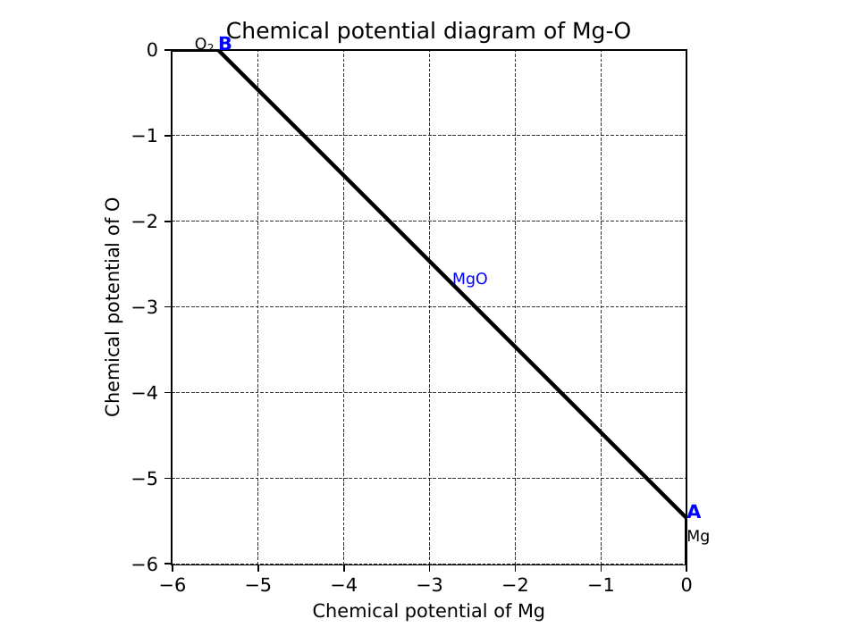
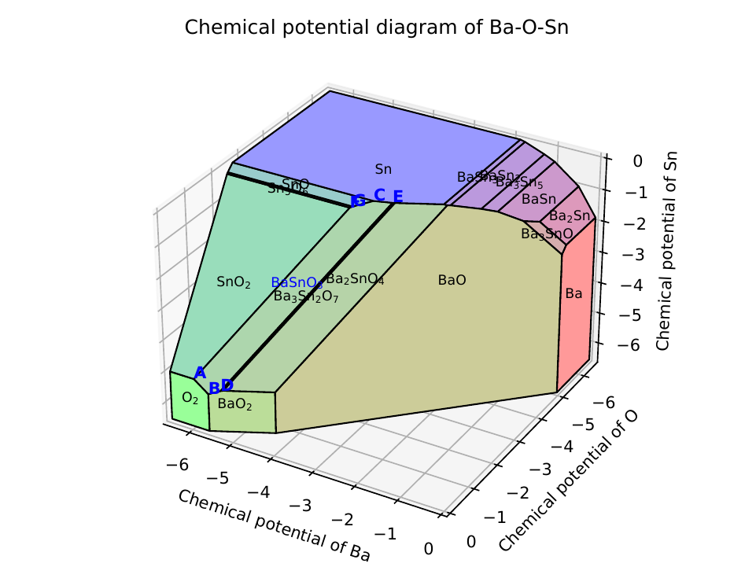
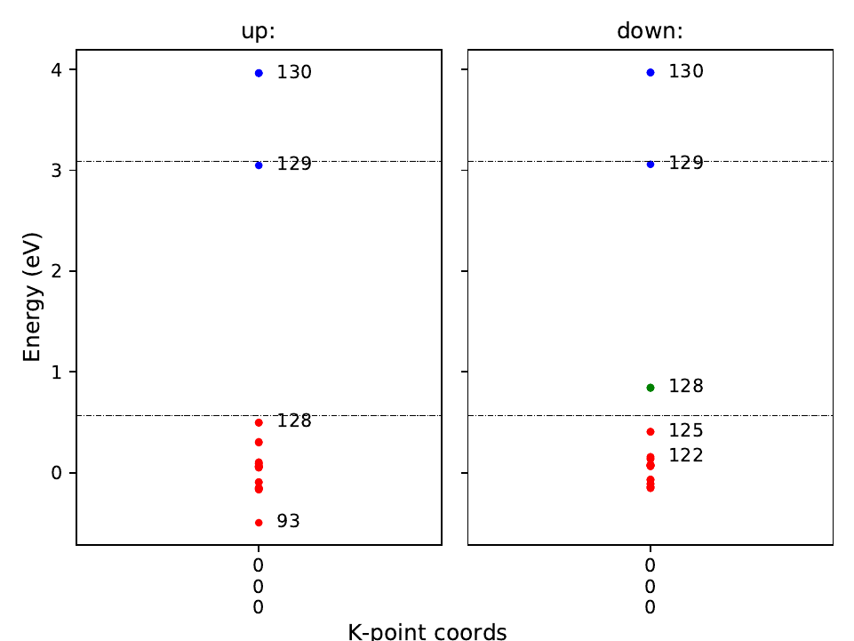
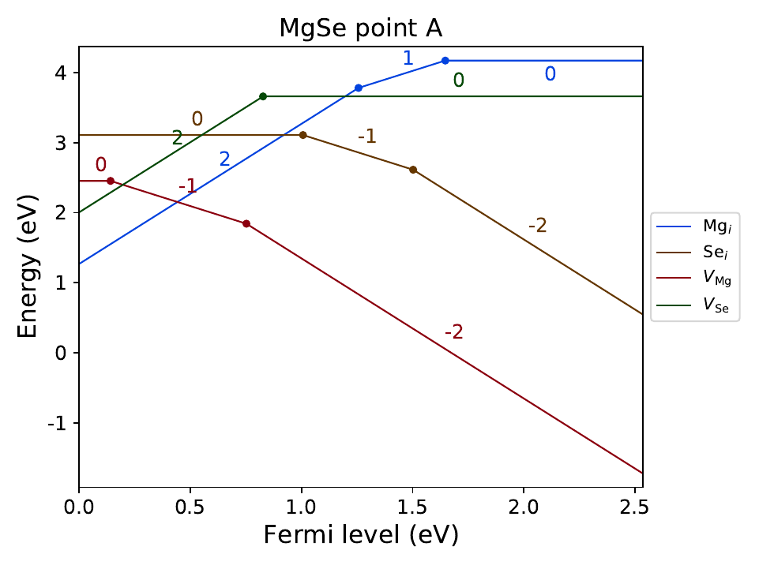

Tutorial of pydefect
--------------------

This page illustrates how to use the :code:`pydefect` code.

**Note1: Pydefect now supports only the vienna ab-initio simulation package (VASP),
so we suppose its input and output file names (e.g., POSCAR, POTCAR, OUTCAR),
and computational techniques (e.g., periodic boundary condition) used in VASP.**

**Note2: Units used in pydefect are eV for energy and Angstrom for length
following the vasp convention.**

**Note3: Only nonmagnetic host materials are supposed.**

Workflow of a point-defect calculation in a non-metallic solid is shown below.
One can see some tasks are performed concurrently, while others must follow some tasks.
Usually, the processes are very intricate and time consuming
and researchers are prone to make some mistakes.
The main purpose of :code:`pydefect` is to provide the researchers
with automation of the point-defect calculation processes
so as to save time and reduce mistakes.

.. image:: flowchart.png

Here, we suppose the following directory tree.
The :code:`<project_name>` is usually the target material name with the
crystal structure if needed, e.g., rutile-TiO\ :sub:`2`.

::

    <project_name>
     │
     ├ pydefect.yaml
     ├ vise.yaml
     │
     ├ unitcell/ ── structure_opt/
     │            ├ band/
     │            └ dos/
     │
     ├ competing_phases/ ── <competing_phase 1>
     │                    ├── <competing_phase 2>
     │                    ....
     │
     └ defects/ ── perfect/
                  ├─ Va_X_0/
                  ├─ Va_X_1/
                  ├─ Va_X_2/
                 ...

We recommend the users to follow the same directory structure if possible.
Details of the processes are examined step by step
with an example of MgSe calculated using the PBEsol functional.

===============================
1. Relaxation of the unit cell
===============================
Point-defect calculations are generally performed at theoretically relaxed
structure under the given functional
and projector augmented wave (PAW) potentials,
as it is free from artificial strain and stress
that is responsible for the unwanted supercell size dependency.
Therefore, one usually begins with optimizing lattice constants
and fractional coordinates of atomic positions in the unitcell.

We first prepare :code:`POSCAR` of the pristine bulk unitcell,
and create :code:`unitcell/` directory and :code:`unitcell/structure_opt/`
sub-directory ( :code:`mkdir -p unitcell/structure_opt/`) and move there.
(In this tutorial, the name with :code:`/` at the end means a directory.)
When :code:`pydefect` needs to construct the vasp input files,
namely :code:`INCAR`, :code:`POTCAR`, :code:`KPOINTS` files,
we use `vise <https://kumagai-group.github.io/vise/>`_
(= :code:`vasp integrated supporting environment`) code,
which generates the input files for various tasks and exchange-correlation (XC) functionals.
:code:`Vise` relies on the `pymatgen <http://pymatgen.org>`_, and
therefore, as shown `pymatgen web page 1 <https://pymatgen.org/usage.html>`_ or
`2 <https://pymatgen.org/_modules/pymatgen/io/vasp/inputs.html>`_,
we need to set the :code:`PMG_DEFAULT_FUNCTIONAL` and :code:`PMG_VASP_PSP_DIR`
in the :code:`.pmgrc.yaml` file at the home directory, e.g.,

::

    PMG_DEFAULT_FUNCTIONAL: PBE_54
    PMG_MAPI_KEY: xxxxxxxxxxxxxxxx
    PMG_VASP_PSP_DIR: /home/kumagai/potcars/

In :code:`pydefect`, :code:`PMG_MAPI_KEY` is required for querying
:code:`POSCAR` files and total energies for competing materials.

Input files for optimizing a unitcell using the PBEsol functional
are generated by the following command,

::

    vise vasp_set -x pbesol

where :code:`vasp_set`, or its abbreviation :code:`vs`,
is a sub-command option of the :code:`vise` main function.
Similarly, all the sub-commands have their own abbreviations
in :code:`pydefect` and :code:`vise`.
Here, the PBE functional is a default in :code:`vise`,
so we use the :code:`-x` argument to switch the XC functional to PBEsol.

There are also many arguments for each sub-command.
One can always refer its help with the :code:`-h` argument,

::

    pydefect vs -h

for details.

Note that the structure optimization must be generally iterated with 1.3 times larger
cutoff energy until the forces and stresses converge at the first ionic step.
See, `vasp manual <https://www.vasp.at/wiki/index.php/Energy_vs_volume_Volume_relaxations_and_Pulay_stress>`_ for details.
Such iteration of the vasp calculations is not supported by :code:`pydefect`,
but one can easily write the simple runshell script to do so.

In :code:`pydefect`, users can control various default parameters
as :code:`vise.yaml` file in :code:`vise`.
See the `document of vise <https://kumagai-group.github.io/vise/>`_ for details.
The controllable parameters are shown in :code:`defaults.py` in :code:`pydefect`.

=====================================================
2. Calculation of band, DOS, and dielectric tensor
=====================================================
We then calculate the band structure (BS), density of states (DOS), and dielectric constants.
In the defect calculations, the BS is used for determining
the valence band maximum (VBM) and conduction band minimum (CBM),
while the static dielectric constant, or a sum of ion-clamped and ionic dielectric tensors,
is needed for correcting the defect formation energies.

First, we create :code:`band/`, :code:`dos/` and :code:`dielectric/` in :code:`unitcell/`
and copy :code:`POSCAR` from :code:`unitcell/structure_opt/`
and type the following command in each directory,

::

    vise vs -x pbesol -t <band, dos or dielectric_dfpt>

:code:`Vise` also provides the plotters for BS and DOS.
See the `document of vise <https://kumagai-group.github.io/vise/>`_ for details.

============================================================================
3. Gathering unitcell information related to point-defect calculations
============================================================================
We next collect the bulk information,
namely the band edges and ion-clamped and ionic dielectric tensors
using the :code:`unitcell` (= :code:`u`) sub-command.

::

    pydefect u --vasprun_band band/vasprun.xml --outcar_band band/OUTCAR --outcar_dielectric_clamped dielectric/OUTCAR --outcar_dielectric_ionic dielectric/OUTCAR

Here, the ion-clamped and ionic dielectric constants can be set
with different :code:`OUTCAR` files.
Then, :code:`unitcell.json` is generated, which will be used for analyzing defect calculations later.
Generally, json files are less readable, so we implement :code:`print` (= :code:`p`)
sub-command to generate readable command line output from json files, which can be used as follows,

::

    pydefect p -f unitcell.json

where the unitcell information is shown as follows:

::

    Unitcell(vbm=0.5461, cbm=3.0807, ele_dielectric_const=[[4.645306, 0.0, 0.0], [0.0, 4.645306, -0.0], [0.0, -0.0, 4.645306]], ion_dielectric_const=[[2.584237, -0.0, -0.0], [-0.0, 2.584192, -0.0], [-0.0, -0.0, 2.584151]])

Users sometimes want to set the unitcell parameters by hands.
In such cases, set parameters using the python script or ipython, and dump the yaml file as follows:

::

    In [1]: from pydefect.analyzer.unitcell import Unitcell

    In [2]: u = Unitcell(vbm=3.0675,cbm=7.7262, ele_dielectric_const=[[3.157296,0,0],[0,3.157296,0],[0,0,3.157296]], ion_dielectric_const=[[6.811496,0,0]
       ...: , [0, 6.811496,0], [0,0,6.811496]])

    In [3]: u.to_json_file()

==================================
4. Calculation of competing phases
==================================
When a defect is introduced, atoms are exchanged with the hypothetical atomic
reservoirs within the thermodynamics framework.
To calculate a free energy of defect formation that is approximated
with the defect formation energy in most cases,
we need to determine atom's chemical potentials associate with creating the defect.
Usually, we consider the chemical potentials at the condition
where competing phases coexist with the host material,
which are determined from the chemical potential diagram.

For this purpose, we create directories in :code:`competing_phases/`.
We can retrieve POSCARs of the stable or slightly unstable competing phases
from `the Materials Project (MP) <https://materialsproject.org>`_.
For this purpose, one needs `the API keys <https://materialsproject.org/open>`_
of the MP as mentioned above.
Here, we obtain the competing materials with MgSe whose energies above hull are less than 0.5 meV/atom using

::

    pydefect mp -e Mg Se --e_above_hull 0.0005

This command creates the following directories:

::

    Mg149Se_mp-1185632/ MgSe_mp-13031/ Mg_mp-1094122/ Se_mp-570481/

In each directory, there are :code:`POSCAR` and :code:`prior_info.yaml`.
The :code:`prior_info.yaml` contains some information in the Materials Project database,
which is useful for determining the first-principles calculation conditions.

For example, :code:`Mg_mp-1094122/prior_info.yaml` is

::

    band_gap: 0.0
    data_source: mp-1094122
    total_magnetization: 0.00010333333333333333

which means Mg is a non-magnetic metallic system.
:code:`Vise` parses the :code:`prior_info.yaml`
and determines the k-point density in :code:`KPOINTS`
and spin polarization via :code:`ISPIN` tag in :code:`INCAR`.

Note that O\ :sub:`2`, H\ :sub:`2`, N\ :sub:`2`, NH\ :sub:`3`, and NO\ :sub:`2` molecules
are not retrieved from MP but created by :code:`pydefect`
since these molecules have been calculated as solids in MP,
which could be inadequate for competing phases for the defect calculations.

We then generate :code:`INCAR`, :code:`POTCAR`, :code:`KPOINTS`
files for competing solids and molecules.
Note, we need to use the **common cutoff energy**, :code:`ENCUT`, for comparing the total energies,
which is increased to 1.3 times of **max** :code:`ENMAX` between the constituent POTCARs.
In case of MgSe, :code:`ENMAX` of Mg and O are 200.0 and 211.555 eV,
so we need to set :code:`ENCUT = 275.022`, using the :code:`vise`

::

    for i in *_*/;do cd $i; vise vs -uis ENCUT 275.022 -x pbesol ; cd ../;done

The target material, namely MgSe in this example, has already been calculated,
so we do not have to iterate the same calculations;
instead make a symbolic link by :code:`ln -s ../unitcell/structure_opt MgSe`
after removing :code:`MgSe_mp-13031/`.
However, if we calculate it with different :code:`ENMAX` to be
consistent with larger :code:`ENMAX` of dopant atoms,
we need to calculate it again.

Note also that, if competing phases are gases, we need to change
:code:`ISIF` to 2 so as not to relax the lattice constants
(see `[vasp manual] <https://cms.mpi.univie.ac.at/wiki/index.php/ISIF>`_),
and :code:`KPOINTS` to the Gamma point sampling.
This is, however, automatically tuned with :code:`vise` via :code:`prior_info.yaml`.

After finishing the vasp calculations,
we can generate the json file for the chemical potential diagram with
the :code:`make_cpd` (= :code:`mcpd`) sub-command:

::

    pydefect mcpd -d *_*/

When renaming the :code:`vasprun.xml` and :code:`OUTCAR` files to e.g.,
:code:`vasprun-finish.xml` and :code:`OUTCAR-finish`,
one needs to write the following in the :code:`pydefect.yaml` file:

::

    # VASP file names
    outcar: OUTCAR-finish
    vasprun: vasprun-finish.xml

To plot the chemical potential diagram,
use the :code:`plot_cpd` (= :code:`pcpd`) sub-command:

::

    pydefect pcpd -y cpd.yaml

which depicts the Mg-O chemical potential diagram that is also saved as :code:`cpd.pdf`.
The binary and ternary chemical potential diagrams look like

Here, relative chemical potentials at the vertices are also shown as follows:

::

    +----+---------+--------+---------+
    |    |   mu_Ba |   mu_O |   mu_Sn |
    |----+---------+--------+---------|
    | A  |  -5.927 |  0     |  -4.966 |
    | B  |  -5.581 |  0     |  -5.312 |
    | C  |  -3.124 | -2.59  |   0     |
    | D  |  -5.352 | -0.114 |  -5.198 |
    | E  |  -2.753 | -2.713 |   0     |
    | F  |  -3.558 | -2.37  |  -0.226 |
    | G  |  -3.503 | -2.4   |  -0.189 |
    +----+---------+--------+---------+

If one needs to modify the energies for the chemical potential diagram,
one can directly modify the :code:`vertices_MgO.yaml` file.

Calculations of the competing phases are often laborious,
and sometimes we wants to roughly check the defect formation energies as soon as possible.
:code:`Pydefect` supports to create the chemical potential diagram
from the Materials Project database.
To do this, however, one needs to prepare atom energies
that are needed to align the element energy standards.

With :code:`vise`, we can easily prepare atom calculation directories.
Here, we show an example of BaSnO\ :sub:`3`:

::

    vise map -e Ba Sn O

Then, create the vasp input files

::

    for i in */;do cd $i; vise vs ; cd ../;done

and run the vasp.
The atomic energies are collected to yaml file using the following python script.

::

    # -*- coding: utf-8 -*-
    #  Copyright (c) 2020. Distributed under the terms of the MIT License.

    from pymatgen import Element
    from pymatgen.io.vasp import Outcar

    for e in Element:
        try:
            o = Outcar(str(e) + "/OUTCAR-finish")
            name = str(e) + ":"
            print(f"{name:<3} {o.final_energy:11.8f}")
        except:
            pass

Assume the output is saved to atom_energies.yaml.
The cpd.yaml file is then generated using the following command.

::

    pydefect mcpd -e Ba Sn O -t BaSnO3 -a atom_energies.yaml

===============================================================
5. Construction of a supercell and defect initial setting file
===============================================================
We have finished the calculations of the unit cell and competing phases,
and are eventually ready for point-defect calculations.
Let's create :code:`defect/` directory and copy unitcell :code:`POSCAR` file from
e.g. :code:`unitcell/dos/` to :code:`defect/`

We then create a supercell and defect-type related files with
the :code:`supercell` (= :code:`s`) and :code:`defect_set` (= :code:`ds`) sub-commands.
:code:`Pydefect` recommends a nearly isotropic (and sometimes cubic-like) supercell
composed of moderate number of atoms.
With the following command, one can create :code:`SPOSCAR` file

::

    pydefect s

If the input structure is different from the standardized primitive cell, :code:`NotPrimitiveError` is raised.

At present, :code:`pydefect` constructs the supercell by expanding the *conventional* unitcell.

It is possible to change the lattice angle of the supercell from those of the conventional unitcell.
For example, we can make a supercell in which a-, b-, and c-axes are mutually orthogonal for hexagonal systems.
However, it is not a good idea for point-defect calculations because such lattice breaks the original symmetry,
which reduces the accuracy of the point-defect calculations and makes it difficult to analyze the defect site symmetry.
One exception in :code:`pydefect` is the tetragonal cell,
where the rotated supercell by 45 degrees keeps the original symmetry.

In :code:`pydefect`, users can also specify the cell matrix, e.g.,

::

    pydefect s --matrix 2 1 1

The matrix is applied to the conventional cell. If one wants to know the conventional cell, type

::

    pydefect s --matrix 1

See the help for more details.

The :code:`supercell_info.json` file contains the full information on the supercell,
which can be seen by using the :code:`-p` option.

::

    Space group: F-43m
    Transformation matrix: [-2, 2, 2]  [2, -2, 2]  [2, 2, -2]
    Cell multiplicity: 32

       Irreducible element: Mg1
            Wyckoff letter: a
             Site symmetry: -43m
             Cutoff radius: 3.373
              Coordination: {'Se': [2.59, 2.59, 2.59, 2.59]}
          Equivalent atoms: 0..31
    Fractional coordinates: 0.0000000  0.0000000  0.0000000
         Electronegativity: 1.31
           Oxidation state: 2

       Irreducible element: Se1
            Wyckoff letter: c
             Site symmetry: -43m
             Cutoff radius: 3.373
              Coordination: {'Mg': [2.59, 2.59, 2.59, 2.59]}
          Equivalent atoms: 32..63
    Fractional coordinates: 0.1250000  0.1250000  0.1250000
         Electronegativity: 2.55
           Oxidation state: -2

With the :code:`defect_set` (= :code:`ds`) sub-command, we can build the :code:`defect_in.yaml` file.
An example of :code:`defect_in.yaml` for MgSe looks as follows,

::

    Mg_Se1: [0, 1, 2, 3, 4]
    Se_Mg1: [-4, -3, -2, -1, 0]
    Va_Mg1: [-2, -1, 0]
    Va_Se1: [0, 1, 2]

where the combination of defect types and their charges are shown.
We can modify this using an editor if necessary.
If we want to add dopants, we can type as follows:

::

    pydefect ds -d Ca

There are some tips related to :code:`supercell_info.json` and :code:`defect_in.yaml`.

1. The antisites and substituted defects are determined from the difference of
the electronegativity between the substituted and removed atoms.
Default max difference is written in :code:`defaults.py`,
but one can change it via :code:`pydefect.yaml` as mentioned above.

2. The oxidation states determine the defect charge states.
For instance, the vacancies (interstitials) of Sn\ :sup:`2+` may take 0, -(+)1, or -(+)2 charge states,
while those of Sn\ :sup:`4+` between 0 and -(+)4 charge states.
For the antisites and substituted defects,
:code:`pydefect` considers all the possible combinations of vacancies and interstitials.
So, for example, Sn\ :sup:`2+` -on-S\ :sup:`2-` takes 0, +1, +2, +3, and +4 charge states.
The oxidation states are determined using the :code:`oxi_state_guesses` method of
:code:`Composition` class in :code:`pymatgen`.
The users can also manually set the oxidation states as follows:

::

    pydefect ds --oxi_states Mg 4

However, the range of the charge state may not be enough in some cases.
For instance, the Zn vacancies in ZnO are known to show the +1 charge state
because they can capture multiple polarons at the neighboring O sites.
See `Frodason et al., Phys. Rev. B (2017) <journals.aps.org/prb/abstract/10.1103/PhysRevB.95.094105>`_
Users have to add these outliers by themselves.

3. By default, positions of atoms neighboring a defect are perturbed
such that the symmetry is lowered to P1.
This is, however, unwanted in some cases because it increases the number of irreducible k-points
Then, :code:`displace_distance` needs to be set to 0 via :code:`pydefect.yaml`.

4. If one wants to calculate particular defects e.g., only oxygen vacancies,
you can restrict the calculated defects with :code:`-k` option and a python regular expression,
For example, when typing as follows,

::

    pydefect ds -k "Va_O[0-9]?_[0-9]+"

these directories are created.

::

    perfect/ Va_O1_0/ Va_O1_1/ Va_O1_2/

===================================
6. Decision of interstitial sites
===================================
In addition to vacancies and antisites, one may want to take into account the interstitials.
Most people determine them by seeing the host crystal structures,
while there are a couple of procedures that recommend the interstitial sites.
However, it is generally not an easy task to speculate the most likely interstitial sites
because they depend on the substituted element.

The largest vacant space should be most likely interstitial sites
for positively charged cations with closed shells (e.g., Mg\ :sup:`2+`, Al\ :sup:`3+`),
as they tend not to make strong bonding with other atoms.
On the other hand, a proton (H\ :sup:`+`) prefers to locate near O\ :sup:`2-` or N\ :sup:`3-`
to form the strong O-H or N-H bonding.
Conversely, a hydride ion (H\ :sup:`-`) should prefer to locate at very much different places.
Therefore, we need to carefully determine the interstitial sites.

:code:`pydefect` holds a utility that recommends the interstitial sites based on
the all electron charge density in the unitcell
using the :code:`ChargeDensityAnalyzer` class implemented in :code:`pymatgen`.
To use this, we need to generate :code:`AECCAR0` and :code:`AECCAR2`
based on the standardized primitive cell.

It is also fine to add this task at the DOS calculations.
The command of :code:`vise` for this is

::

    vise vs -uis LAECHG True -t dos

This should not be done at the BS calculations, because the primitive cells
may be different from the standardized primitive cell in particular space groups.

After running the vasp calculation, run the recommend_interstitials.py in pydefect

::

    python pydefect/cli/vasp/util_commands/recommend_interstitials.py AECCAR0 AECCAR2

, which shows the local minimum points of the charge density as follows.

::

              a         b         c  Charge Density
    0  0.750000  0.750000  0.750000        0.527096
    1  0.500000  0.500000  0.500000        0.669109
    2  0.611111  0.611111  0.166667        1.020380
    3  0.166667  0.611111  0.611111        1.020382
    4  0.611111  0.166667  0.611111        1.020382
    Host symmetry R3m
    ++ Inequivalent indices and site symmetries ++
      0   0.7500   0.7500   0.7500 3m
      1   0.5000   0.5000   0.5000 3m
      2   0.6111   0.6111   0.1667 .m

Note, again, that the local minima may not be the best initial points
for some particular interstitials,
so users must need to recognize the limit of this procedure.

To add the interstitial site at e.g., 0.75  0.75  0.75,
where the fractional coordinates are based on the standardized primitive cell,
we use the :code:`interstitial` (= :code:`i`) sub-command like

::

    pydefect ai -s supercell_info.json -p ../unitcell/structure_opt/POSCAR -c 0.75 0.75 0.75

:code:`supercell_info.json` is then updated,
which includes the information of the interstitial sites.

::

    ...
    -- interstitials
    #1
    Fractional coordinates: 0.3750000  0.3750000  0.3750000
            Wyckoff letter: c
             Site symmetry: -43m
              Coordination: {'Mg': [2.59, 2.59, 2.59, 2.59], 'Se': [3.0, 3.0, 3.0, 3.0, 3.0, 3.0]}

If we want to add another site at e.g. 0.5 0.5 0.5 ,
:code:`supercell_info.json` is again updated.

To pop the interstitial sites, use

::

    pydefect pi -i 1 -s supercell_info.json

The first interstitial locating at (0.75, 0.75, 0.75) is removed from :code:`supercell_info.json`.

===============================================
7. Creation of defect calculation directories
===============================================
We next create directories for point-defect calculations with the :code:`defect_entries` (= :code:`de`) sub-command,

::

    pydefect de

With this command, defect calculation directories are created, including :code:`perfect/`.

If you again type the same command, the following information appears,

::

    2020/11/24 20:40:27    INFO pydefect.cli.vasp.main_function
     --> perfect dir exists, so skipped...
    2020/11/24 20:40:27    INFO pydefect.cli.vasp.main_function
     --> Va_Se1_1 dir exists, so skipped...
    2020/11/24 20:40:27    INFO pydefect.cli.vasp.main_function
     --> Va_Se1_2 dir exists, so skipped...
    2020/11/24 20:40:27    INFO pydefect.cli.vasp.main_function
     --> Va_Se1_0 dir exists, so skipped...
    ...

and no directories are newly created.
This is a fail-safe treatment so as not to delete the calculated directories by mistake.
If you really want to recreate the directories, you need to remove directories first.

In each directory, one can find the :code:`defect_entry.json` file,
which contains information about a point defect obtained
before running the first-principles calculations.
To see :code:`defect_entry.json`, again use the :code:`-p` option.

When you'd like to add some particular defects,
you can modify the :code:`defect_in.yaml` and type the :code:`de` option again.

====================================
8. Generation of defect_entry.json
====================================
Sometimes, one may want to treat complex defects.
For instance, O\ :sub:`2` molecules act as anions in MgO\ :sub:`2`,
where O\ :sub:`2` molecule vacancies are able to exist.
Other important examples are the methylammonium lead halides (MAPI),
where methylammonium ions acts
as singly positive cations (CH\ :sub:`3`\ NH\ :sub:`3`\ :sup:`+`), and DX centers,
where anion vacancies and interstitial cations coexist.

In these cases, one needs to prepare the input files and runs the vasp calculations by oneself.
However, :code:`pydefect` necessitates the :code:`defect_entry.json` file for the postprocess,
which cannot be easily generated by the users.

In aid of this, :code:`pydefect` provides the :code:`create_defect_entry.py`,
which parses the :code:`POSCAR` files and defect name as follows.

::

    python $PATH_TO_FILE/create_defect_entry.py complex_2 complex_2/POSCAR perfect/POSCAR

which creates the :code:`defect_entry.json` file. The directory name is then parsed as

::

    A_B -> name='A', charge=B

This script can be used when one wants to use :code:`pydefect`
for analyzing the defect calculations in progress.

==========================================
9. Parsing supercell calculation results
==========================================
Then, let's run the vasp calculations.

To create the vasp input files, type

::

    for i in */;do cd $i; vise vs -t defect ; cd ../;done

Do not forget to add :code:`-t defect`, to create the input files for defects.

When running the vasp, We recommend the users to use the Gamma-only vasp
if the k point is sampled only at the Gamma point for large supercells.

After (partly) finishing the vasp calculations,
we can generate the :code:`calc_results.json` that contains
the first-principles calculation results related to the defect properties.

By using the :code:`calc_results` (= :code:`cr`) sub-command,
we can generate :code:`calc_results.json` in all the calculated directories.

::

    pydefect cr -d *_*/ perfect

When one wants to generate :code:`calc_results.json`
for some particular directories, e.g., Va_O1_0, type

::

    pydefect cr -d Va_O1_0

============================================================================
10. Corrections of defect formation energies in finite-size supercells
============================================================================
When the supercell method is adopted under the periodic boundary condition,
the total energies for **charged defects** are not properly estimated
due to interactions between a defect, its images, and background charge.
Therefore, we need to correct the total energies of the charged defect supercells
to those in the dilution limit.

The corrections are performed using the
:code:`extended_fnv_correction` (= :code:`efnv`) sub-command,

::

    pydefect efnv -d *_*/ -pcr perfect/calc_results.json -u ../unitcell/unitcell.json

For the corrections, we need the static dielectric constants
and atomic site potentials in the perfect supercell.
Therefore, the paths to :code:`unitcell.json` and :code:`calc_results.json` of
:code:`perfect` must be assigned.
Bear also in mind that this command takes some time.

The energy correction in :code:`pydefect` at this moment is now performed with
the so-called extended Freysoldt-Neugebauer-Van de Walle (eFNV) method.
If one uses the corrections, please cite the following papers.

- `C. Freysoldt, J. Neugebauer, and C. Van de Walle, Fully Ab Initio Finite-Size Corrections for Charged-Defect Supercell Calculations, Phys. Rev. Lett., 102 016402 (2009). <https://journals.aps.org/prl/abstract/10.1103/PhysRevLett.102.016402>`_

- `Y. Kumagai* and F. Oba, Electrostatics-based finite-size corrections for first-principles point defect calculations, Phys. Rev. B, 89 195205 (2014). <https://journals.aps.org/prb/abstract/10.1103/PhysRevB.89.195205>`_

One obtains :code:`correction.pdf` file, which contains information
about defect-induced and point-charge potential,
and their differences at atomic sites as shown below.

.. image:: correction_pdf_MgSe_Va_Mg_2.png

The height of the horizontal line indicates the averaged potential difference
between the point-charge potential and that caused by the defect,
namely potential in the defective supercell minus that in the perfect supercell.
The range of the line means the averaged region. See
`Y. Kumagai* and F. Oba (2014) <https://journals.aps.org/prb/abstract/10.1103/PhysRevB.89.195205>`_
for details.

When performing the corrections, I strongly recommend you to check
all the :code:`correction.pdf` files for the calculated defects
so as to reduce careless mistakes as much as possible.

============================================================================
11. Check defect eigenvalues and band-edge states in supercell calculations
============================================================================
Generally, point defects are divided into three types.

(1) Defects with deep localized states inside the band gap.
This type of defect is generally considered to be detrimental
for device performances as the carriers are trapped by the localized states.
Furthermore, they could act as color centers, as represented by the vacancies in NaCl.
Therefore, it is important to know the position of the localized state and its origin.

(2) Defects with hydrogenic carrier states, or perturbed host states (PHS),
where carriers locate at the band edges with loosely trapped by the charged defect centers.
Examples are the B-on-Si (p-type) and P-on-Si (n-type) substitutional dopants in Si.
These defects also do little harm for device performances,
but introduce the carrier electrons/holes or kill counter carriers stemming from small trapping energies.
The wavefunctions of the PHS widespread to several million atoms.
Therefore, to calculate their thermodynamical transition levels,
we need supergiant supercell calculations,
which are almost prohibitive with first-principles calculations thus far.
Therefore, we instead usually avoid calculating these quantities and
denote that the defects have PHS and their transition energies locate near band edges only qualitatively.

(3) Defects without any defect states inside the band gap or near the band edges,
which would not largely affect the electronic properties
as long as their concentrations are not exceedingly high.

See some examples from our published papers.

- `Y. Kumagai*, M. Choi, Y. Nose, and F. Oba, First-principles study of point defects in chalcopyrite ZnSnP2, Phys. Rev. B, 90 125202 (2014). <https://link.aps.org/pdf/10.1103/PhysRevB.90.125202>`_

- `Y. Kumagai*, L. A. Burton, A. Walsh, and F. Oba, Electronic structure and defect physics of tin sulfides: SnS, Sn2S3, and SnS2, Phys. Rev. Applied, 6 014009 (2016). <https://link.aps.org/doi/10.1103/PhysRevApplied.6.014009>`_

- `Y. Kumagai*, K. Harada, H. Akamatsu, K. Matsuzaki, and F. Oba, Carrier-Induced Band-Gap Variation and Point Defects in Zn3N2 from First Principles, Phys. Rev. Applied, 8 014015 (2017). <https://journals.aps.org/prapplied/abstract/10.1103/PhysRevApplied.8.014015)>`_

- `Y. Kumagai*, N. Tsunoda, and F. Oba, Point defects and p-type doping in ScN from first principles, Phys. Rev. Applied, 9 034019 (2018). <https://journals.aps.org/prapplied/abstract/10.1103/PhysRevApplied.9.034019>`_

- `N. Tsunoda, Y. Kumagai*, A. Takahashi, and F. Oba, Electrically benign defect behavior in ZnSnN2 revealed from first principles, Phys. Rev. Applied, 10 011001 (2018). <https://journals.aps.org/prapplied/abstract/10.1103/PhysRevApplied.10.011001>`_

To distinguish these three defect types, one needs to look see the defect levels
and judge if the defects create the PHS and/or defect localized states.

:code:`Pydefect` shows the eigenvalues and band-edge states by the following steps.

Firstly, one can generate the :code:`band_edge_eigenvalues.json`
and :code:`eigenvalues.pdf` files with the following command.

::

    pydefect eig -d *_*/ -pcr perfect/calc_results.json

The :code:`eigenvalues.pdf` file looks like,

Here, one can see single-particle levels and their occupation in the spin-up and -down channels.
The x-axis is fractional coordinates of the calculated k points,
while the y-axis in the absolute energy scale.
Filled circles inside the figures are single particle levels at each k point.

Two horizontal dashed lines indicate
the valence-band maximum and conduction-band minimum in the **perfect supercell**.
The discrete numbers in the figures mean the band indices starting from 1,
and the filled red, green, and blue circles mean the occupied,
partially occupied (from 0.1 to 0.9), and unoccupied eigenstates, respectively.

We then generate the :code:`edge_characters.json` file with the following command.

::

    pydefect make_edge_characters -d *_*/ -pcr perfect/calc_results.json

and analyze the files and show the edge states with this command

::

    pydefect edge_states -d *_*/ -p perfect/edge_characters.json

which shows as follows:

::

    -- Mg_i1_0
    spin up   Donor PHS
    spin down Donor PHS
    -- Mg_i1_1
    spin up   Donor PHS
    spin down No in-gap state
    -- Mg_i1_2
    spin up   No in-gap state
    spin down No in-gap state
    -- Va_Mg1_-1
    spin up   No in-gap state
    spin down In-gap state
    -- Va_Mg1_-2
    spin up   In-gap state
    spin down In-gap state
    -- Va_Mg1_0
    spin up   No in-gap state
    spin down In-gap state

There are four states :code:`donor_phs`, :code:`acceptor_phs`, :code:`localized_state`, :code:`no_in_gap`,
the former two are considered as shallow states, and should be omitted for energy plot.

In :code:`pydefect`, these states are determined from the highest occupied and lowest unoccupied eigenvalues
and the similarity of wavefunction of the highest occupied (lowest unoccupied) state and that of the VBM (CBM).

We emphasize that the automatically determined band-edge states could be incorrect
as it is generally difficult to determine them automatically.
Therefore, please carefully check the band-edge states,
and draw their band-decomposed charge density if the band-edge states are not obvious.

The band-edge states can be modified via the :code:`band_edge_states.yaml` file
in each defect directory, which will be parsed when plotting the defect
formation energies.

=====================================
12. Plot defect formation energies
=====================================
Here, we show how to plot the defect formation energies.

The plot of the defect formation energies requires multiple information,
namely band edges, chemical potentials of competing phases,
and total energies of perfect and defective supercells.

The defect formation energies are plotted as a function of the Fermi level
with the :code:`plot_energy` (= :code:`pe`) sub-command

::

    pydefect e --unitcell ../unitcell/unitcell.json --perfect perfect/calc_results.json -d Va*_* -c ../competing_phases/cpd.yaml -l A

which shows like,

When changing the condition for chemical potential, namely the position of the vertex in the chemical potential diagram,
use the :code:`-l` option.
