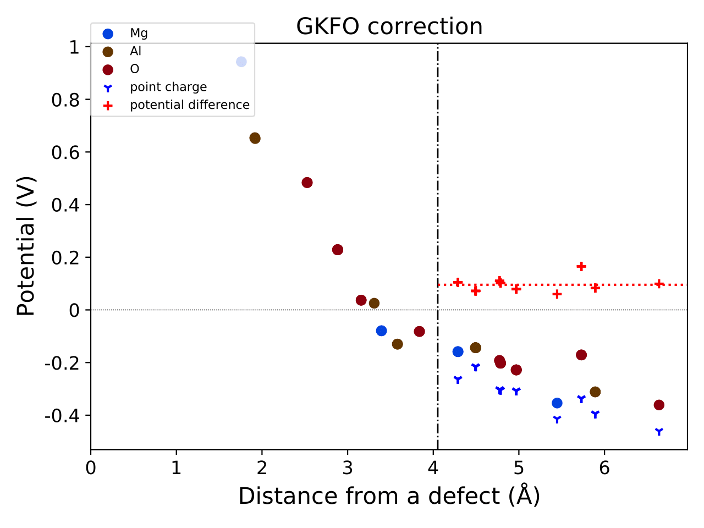

Tutorial for calculation of vertical transition level
-----------------------------------------------------

Here, we illustrate how to calculate the vertical transition level (VTL)
using the example of an oxygen vacancy in MgAl₂O₄.
To calculate the VTL, we apply a specific correction scheme,
here referred to as the GKFO correction.
For further details, please refer to:

`T. Gake, Y. Kumagai*, C. Freysoldt, and F. Oba, Phys. Rev. B, 101, 020102(R) (2020) <https://link.aps.org/doi/10.1103/PhysRevB.101.020102>`_

We assume that defect calculations for MgAl₂O₄ using the PBEsol functional
have already been performed as introduced in the tutorial,
and we now aim to compute the photo-absorption energy
corresponding to the excitation of a localized state
associated with a neutral oxygen vacancy to the CBM.

The following directory structure is assumed:

::

    MgAl2O4
     │
     ├ unitcell/ ── unitcell.json
     │
     └ defects/ ── perfect/
                 └ Va_O1_0/ ── absorption/

First, create the :code:`absorption/` directory inside :code:`Va_O1_0/`
and copy the VASP input files from :code:`Va_O1_0/`.
Then, edit the :code:`INCAR` file by setting :code:`NSW = 1` and reducing the
:code:`NELECT` value by 1 from the neutral state.
Alternatively, use the following command:

::

    vise vs -uis NSW 1 --options charge 1 -d ../ -t defect

After running VASP, generate :code:`calc_results.json`
within the :code:`absorption/` directory by executing:

::

    pydefect cr -d .

Then, generate the :code:`gkfo_correction.pdf` and :code:`gkfo_correction.json`
files using the following command:

::

    pydefect_util gkfo -u ../../../unitcell/unitcell.yaml -iefnv ../correction.json -icr ../calc_results.json -fcr calc_results.json -cd 1

You can check the correction energy using the :code:`pydefect_print` command,
which yields output like the following:

::

    +--------------------+------------+
    | charge             |  0         |
    | additional charge  |  1         |
    | pc 1st term        |  0         |
    | pc 2nd term        |  0.819326  |
    | alignment 1st term | -0.0953654 |
    | alignment 2nd term | -0.10711   |
    | alignment 3rd term | -0         |
    | correction energy  |  0.61685   |
    +--------------------+------------+

The :code:`gkfo_correction.pdf` shows the potential profile
resulting from the addition/removal of an electron,
along with its alignment contributions.

To compute the absorption energy, we need the conduction band minimum (CBM),
which is 9.2376 eV for MgAl₂O₄.
Assuming the total energies of the initial and final states are
-405.739 eV and -411.920 eV, respectively,
the absorption energy is computed as:

::

    -411.920 + 405.739 + 9.2376 + 0.61685 = 3.67345 eV

It is also informative to inspect the eigenvalues of the initial and final states.

You can visualize these using :code:`eigenvalues.pdf`, which appear as:

.. image:: eigenvalues_final.png

And for the initial state:

.. image:: eigenvalues_initial.png
