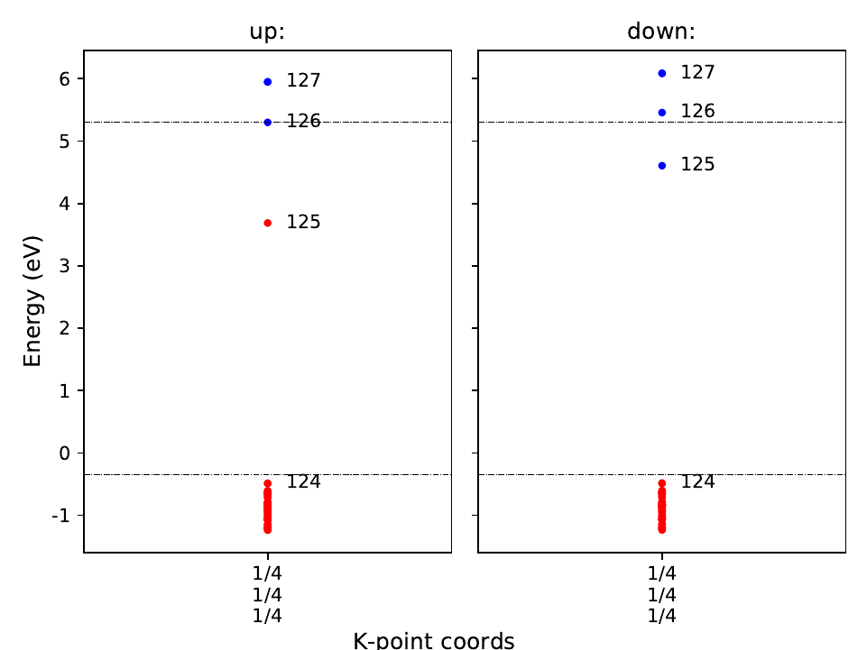

Tutorial for calculation of vertical transition level
-----------------------------------------------------

We here illustrate how to calculate the vertical transition level (VTL)
with an example of NaCl.
For the calculation of the VTL, we need to apply special correction scheme,
here we call it the GKFO correction.
Please read
`T. Gake, Y. Kumagai*, C. Freysoldt, and F. Oba, Phys. Rev. B, 101, 020102(R) (2020).
<link.aps.org/doi/10.1103/PhysRevB.101.020102>`_

Assuming that the typical defect calculations based on the PBEsol functional
as introduced in the tutorial have been done already
and one further wants to calculate the photo-absorption energy
via Cl vacancy in the neutral charge state.

::

    NaCl
     │
     ├ unitcell/ ── unitcell.json
     │
     └ defects/ ── perfect/
                 └ Va_Cl_0/ ── absorption/

Firstly, create the :code:`absorption/` directory at the :code:`Va_Cl_0/`
and copy the vasp input files.
Then, edit :code:`INCAR` to change :code:`NSW` to 1 and add :code:`NELECT` with
reducing it by 1, and run vasp.

Or one can type:

::

    vise vs -uis NSW 1 --options charge -1 -d ../ -t defect

We then create :code:`calc_results.json` using the following command in the
:code:`absorption/` directory.

::

    pydefect cr -d .

Then, type

::

    pydefect gkfo -u ../../../unitcell/unitcell.json -iefnv ../correction.json -icr ../calc_results.json -fcr calc_results.json -cd 1

With this command, one can obtain :code:`gkfo_correction.pdf` and :code:`gkfo_correction.json` files,
and the correction energy is shown as follows:

::

    +--------------------+------------+
    | charge             |  0         |
    | additional charge  |  1         |
    | pc 1st term        |  0         |
    | pc 2nd term        |  0.731247  |
    | alignment 1st term | -0.0338952 |
    | alignment 2nd term | -0.113709  |
    | alignment 3rd term | -0         |
    | correction energy  |  0.583643  |
    +--------------------+------------+

The :code:`gkfo_correction.pdf` shows the potential profile caused by addition/removal
of the electron and its alignment term.

.. image:: gkfo_correction.png

For the absorption energy, one needs to know the conduction band minimum position,
which is now 4.7777. And the total energies of initial and final states are
-219.02114546 and -222.32750506.
Therefore, the absorption energy is

::

    -222.32750506+219.02114546+4.7777+0.583643 = 2.0549834

It is also worthwhile to check the eigenvalues of initial and final states.
Using the :code:`eig` sub-parser as follows,

::

    pydefect -d . -pcr ../../perfect/calc_results.json

we can obtain the :code:`eigenvalues.pdf`, which looks as

.. image:: NaCl_final_eigenvalues.png

and the initial :code:`eigenvalues.pdf` looks as

